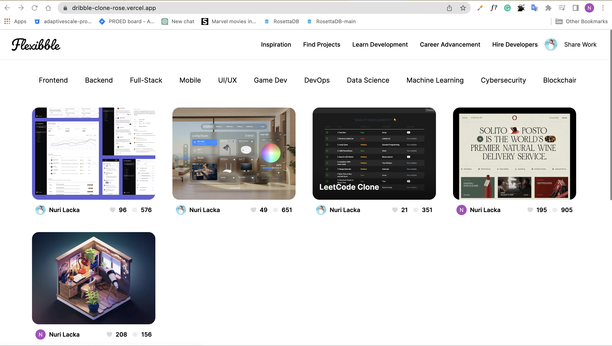

# Dribble Clone

A clone of the popular design platform Dribbble, built using Next.js 13, Tailwind CSS, and Grafbase as the backend database. This project utilizes NextAuth for authentication and user management.

## General info

The Dribbble Clone project aims to replicate the core features and functionalities of Dribbble, providing a platform for designers to showcase their work, discover creative inspiration, and connect with other designers. It serves as a playground for designers to share their design shots, receive feedback, and engage with the design community.

## Live preview

[link](https://dribble-clone-rose.vercel.app)

## Screenshots

## Technologies

Project is created with:

- React
- NextJS
- Typescript
- TailwindCSS
- Grafbase

## Setup

To set up the Drible Clone project locally, follow these steps:

- Clone the repository: git clone https://github.com/Nuri1977/dribble-clone.git
- Install dependencies: cd leetcode-clone then npm install
- Set up Garafbase project and obtain necessary credentials, install ittt localy.
- Start the development server: npm run dev
- Access the project at http://localhost:3000.

## Author

👤 **Nuri Lacka**

- GitHub: [@Nuri1977](https://github.com/Nuri1977)
- Twitter: [@Lackanuri](https://twitter.com/LackaNuri)
- LinkedIn: [@nurilacka](https://www.linkedin.com/in/nuri-lacka-7141b01ba/)

## 🤝 Contributing

Contributions, issues, and feature requests are welcome!

Feel free to check the [issues page]().

## Show your support

Give a ⭐️ if you like this project!

## Acknowledgments

- A special thanks to [Adrian Hajdin](https://github.com/adrianhajdin/project_nextjs13_flexibble) and his youtube chaannel [Javascript Mastery](https://www.youtube.com/watch?v=986hztrfaSQ&list=PL_HQtCvFI4x2RkIUuH_M5LJ091pWzXoSP&index=19).

## 📝 License

This project is [MIT](LICENSE) licensed.
